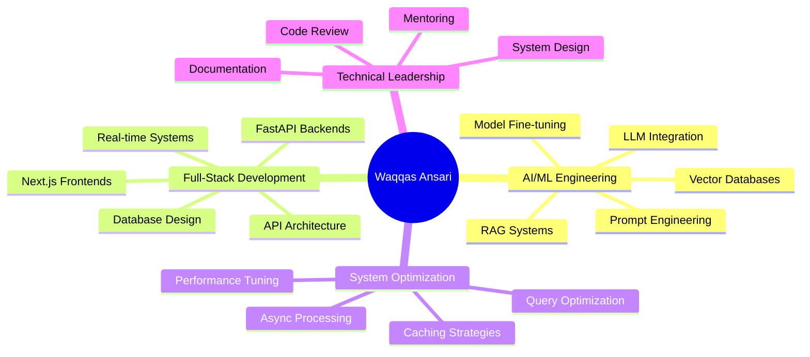

<div align="center">

<!-- Animated Header -->


<!-- Typing SVG -->
<a href="https://git.io/typing-svg"></a>

<br/>

[](https://linkedin.com/in/waqqas-ansari)
[](mailto:waqmid@gmail.com)
[](https://analyticsindiamag.com/author/waqqas-ansari)
[](tel:+917007506972)

</div>

---

## 🎯 What I Do


I architect **AI-powered systems** that solve real-world problems — from **40% efficiency gains** in talent acquisition SaaS to **real-time LLM integrations** that eliminate manual workflows. 

My work spans the full stack: designing scalable FastAPI backends, building responsive Next.js frontends, and implementing production-grade AI assistants that users actually love.

### 🚀 Quick Stats
- 💼 Currently building at **Axiom Global Technologies**
- 🧠 Specialized in **AI/ML Systems** & **Full-Stack Development**
- 🎓 **4+ Certifications** in Deep Learning & AI
- 📝 Published **Technical Writer** at Analytics India Magazine
- 🌱 Currently exploring **LLM Fine-tuning** & **MCP Servers**

<br clear="right"/>

```python
class WaqqasAnsari:
    def __init__(self):
        self.role = "Associate Software Engineer @ Axiom Global Technologies"
        self.location = "Kanpur, India 🇮🇳"
        self.focus = ["AI/ML Systems", "Full-Stack Development", "API Architecture"]
        self.passion = "Making AI practical, scalable, and human-centered"
    
    def current_stack(self):
        return {
            "backend": ["FastAPI", "Django", "PostgreSQL", "Redis"],
            "frontend": ["Next.js", "React", "TypeScript", "React Query"],
            "ai_ml": ["OpenAI APIs", "LangChain", "RAG", "Vector DBs", "MCP"],
            "data": ["Pandas", "Scrapy", "ETL Pipelines", "MongoDB"]
        }
    
    def achievements(self):
        return {
            "efficiency_boost": "40-50%",
            "automation": "90% reduction in manual work",
            "ai_accuracy": "95% instruction compliance",
            "live_products": "5+ production AI assistants"
        }
```

---

## 💼 Professional Highlights

<details open>
<summary><b>🚀 Axiom Global Technologies</b> — <i>Associate Software Engineer (Jun 2025 – Present)</i></summary>
<br/>

Building an AI-powered **talent acquisition SaaS** that transformed Excel-based recruiting workflows:

- ⚡ **40-50% efficiency boost** for recruiters across sourcing, scheduling, and reporting
- 🔄 Eliminated **90% of manual data entry** through real-time platform integrations
- 🧠 AI-driven candidate matching improving shortlisting accuracy by **25-30%**
- 🏗️ Designed **custom MCP server** to connect LLMs with internal APIs (60% reduction in integration effort)
- ⚙️ Optimized caching strategy: **40% faster API responses**, **60%+ reduction** in redundant DB hits
- 📊 Built real-time analytics dashboards reducing interview coordination overhead by **50%**

**Tech Stack:** `FastAPI` `PostgreSQL` `Next.js` `Redis` `React Query` `MCP` `LLMs`

</details>

<details>
<summary><b>🤖 Idea Usher (ProIU)</b> — <i>AI Developer (Oct 2024 – Mar 2025)</i></summary>
<br/>

Shipped **5+ production AI assistants** across trading, wellness, coaching, and education:

- 📊 Built multimodal trading assistant with **chart analysis** and emotion-aware guidance
- ⏱️ Reduced reasoning latency by **35-45%** through async, event-driven architectures
- 🎯 Achieved **~95% instruction compliance** with modular prompt engineering and safety guardrails
- 🧩 Developed **RAG-based systems** improving answer relevance by **40%** over baseline
- 💬 Wellness assistant increased user session duration by **25%**

**Tech Stack:** `Python` `OpenAI APIs` `GPT-4o` `RAG` `Vector Databases` `Function Calling`

</details>

<details>
<summary><b>🛠️ Inventify.ae</b> — <i>AI/ML Developer (Feb 2024 – Jul 2024)</i></summary>
<br/>

Created a plug-and-play **RAG chatbot SaaS** with Django + LangChain:

- 📦 Reduced setup time by **60-70%** through multi-tenant backend architecture
- 🔒 Implemented database-level guardrails for safe LLM data exposure
- ⚡ Optimized RAG retrieval reducing response latency by **25%**
- 🌱 Built plant disease classifier with **ResNet34** achieving **92% accuracy**

**Tech Stack:** `Django` `LangChain` `RAG` `PyTorch` `ResNet34` `Vector Databases`

</details>

<details>
<summary><b>📊 Zintlr</b> — <i>Data Scientist (Apr 2023 – Aug 2023)</i></summary>
<br/>

Led large-scale data acquisition and analytics:

- 🕷️ Accelerated data acquisition by **50%** using Scrapy, BeautifulSoup, and Selenium
- 🧹 Improved dataset reliability by **30%** through comprehensive data cleaning
- ⚡ Optimized MongoDB queries reducing response times by **25%**
- 📈 Contributed to **15% improvement** in sales targeting through actionable insights

**Tech Stack:** `Python` `Scrapy` `Selenium` `MongoDB` `ETL Pipelines` `Data Visualization`

</details>

---

## 🎨 Featured Projects

<div align="center">

| Project | Description | Tech Stack | Status |
|---------|-------------|------------|--------|
| **[💰 ChopChopPay](https://chopchoppay.com)** | AI-powered bill-splitting platform with OCR, multi-currency, who-owes-who matrix | `FastAPI` `Next.js` `PostgreSQL` `OpenAI` | 🟢 **Live** |
| **🧮 Qwen3 GRPO Fine-Tuning** | RL-based LLM alignment using Group Relative Policy Optimization | `PyTorch` `Transformers` `GRPO` | ✅ Complete |
| **📐 Math Problem Classifier** | Fine-tuned Qwen3 for topic and difficulty categorization | `Qwen3` `Supervised Learning` | ✅ Complete |
| **🔍 RAG Chatbot SaaS** | Multi-tenant knowledge assistant with vector search | `Django` `LangChain` `Vector DBs` | ✅ Complete |

</div>

---

## 🛠️ Technical Arsenal

<div align="center">

### 💻 Languages


### 🤖 AI & Machine Learning


### ⚙️ Backend & APIs


### 🎨 Frontend


### 🛠️ Tools & DevOps


</div>

---

## 📊 GitHub Statistics

<div align="center">
   
  
</div>

<div align="center">
  
  
</div>

<div align="center">
  
</div>

---

## 🏆 GitHub Trophies

<div align="center">
  
</div>

---

## 📈 Impact Metrics

<div align="center">

| 🎯 Metric | 📊 Achievement |
|-----------|----------------|
| **Efficiency Gains** | 40-50% improvement in talent acquisition workflows |
| **Data Entry Reduction** | 90% elimination through automation |
| **API Performance** | 40% faster response times with caching |
| **AI Accuracy** | 95% instruction compliance in production |
| **Latency Reduction** | 35-45% decrease in reasoning time |
| **Model Accuracy** | 92% in plant disease classification |
| **Production AI Systems** | 5+ assistants shipped and active |
| **Database Optimization** | 60%+ reduction in redundant DB hits |

</div>

---

## 📚 Continuous Learning

<div align="center">

**🎓 Certifications**

[](https://www.coursera.org/)
[](https://www.coursera.org/)
[](https://www.ibm.com/)
[](https://www.coursera.org/)

</div>

---

## 💡 Core Competencies

<div align="center">



</div>

---

## 🌟 Recent Activity

<!--START_SECTION:activity-->
<!--END_SECTION:activity-->

---

## 🤝 Let's Connect & Collaborate

<div align="center">

I'm always excited to collaborate on innovative AI projects, discuss technical architecture, or explore new opportunities. Whether you're building the next big thing or just want to chat about LLMs and system design, let's talk!

<br/>

[](https://linkedin.com/in/waqqas-ansari)
[](mailto:waqmid@gmail.com)
[](https://github.com/waqqasansari)
[](https://wa.me/917007506972)

<br/>

### 📫 Quick Links

🌐 **Published Work:** [Analytics India Magazine](https://analyticsindiamag.com/author/waqqas-ansari)  
💼 **Current Role:** Associate Software Engineer @ Axiom Global Technologies  
📍 **Location:** Kanpur, Uttar Pradesh, India  
🕐 **Timezone:** IST (UTC+5:30)

---


<br/>

<p align="center">
  
</p>

<p align="center">
  <i>"The best way to predict the future is to build it." — Alan Kay</i>
</p>

<div align="center">
  
### 💖 Show some love by starring some repositories!

</div>

</div>
