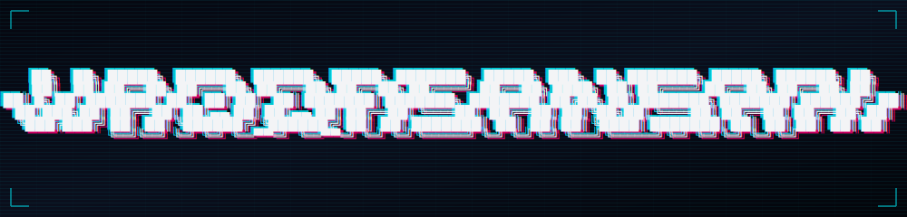

<div align="center">

<!-- ════════════════════════════════════════════════════════════════ -->
<!--  ANIMATED HEADER — Glitch Name Header                          -->
<!-- ════════════════════════════════════════════════════════════════ -->



<br/>

[](https://chopchoppay.com)
[](https://linkedin.com/in/waqqas-ansari)
[](mailto:waqmid@gmail.com)
[](https://analyticsindiamag.com/author/waqqas-ansari)

<br/>


</div>

---

## 💻 `~/whoami`

Hi, I'm **Waqqas** — an AI / Full-Stack Software Engineer based in India. I build production systems where AI is a first-class citizen — from B2B vendor portals with LLM-assisted invoice validation, to RAG-powered assistants, to fine-tuning Qwen3 with GRPO. End-to-end ownership across frontend, backend, cloud, AI, and security.

<table>
  <tr><td>🏢&nbsp;&nbsp;<b>Currently</b></td><td>Associate Software Engineer @ Axiom Global Technologies</td></tr>
  <tr><td>📍&nbsp;&nbsp;<b>Based in</b></td><td>India</td></tr>
  <tr><td>🎯&nbsp;&nbsp;<b>Focus</b></td><td>GenAI · RAG · MCP Servers · SaaS Platforms</td></tr>
  <tr><td>🛠️&nbsp;&nbsp;<b>Stack</b></td><td>Next.js · FastAPI · PostgreSQL · Azure · LLMs</td></tr>
  <tr><td>🧪&nbsp;&nbsp;<b>Researching</b></td><td>Qwen3 fine-tuning with GRPO &amp; SFT</td></tr>
  <tr><td>✨&nbsp;&nbsp;<b>Now</b></td><td>Shipping B2B AI workflows + automation for enterprise</td></tr>
  <tr><td>💬&nbsp;&nbsp;<b>Ask me about</b></td><td>RAG architecture, MCP servers, production LLM pipelines</td></tr>
</table>

---

## 🛠️ `~/stack`

<table>
<tr>
<td valign="top" width="33%">

### 🧠 AI / ML / GenAI


* **LLMs** · RAG · Function Calling
* **Model Context Protocol** (MCP)
* **Vector DBs** · Semantic Search
* **Prompt Engineering** · Guardrails
* **Fine-tuning** (GRPO, SFT)
* **LlamaIndex** · LangChain

</td>
<td valign="top" width="33%">

### ⚙️ Backend


* **REST APIs** · WebSockets
* **SQLAlchemy** · Pydantic
* **JWT** · OAuth 2.0
* **Async Pipelines** (Celery/Asyncio)
* **Supabase** · Query Optimization

</td>
<td valign="top" width="33%">

### 🎨 Frontend


* **React Query** · Zod
* **Optimistic State Updates**
* **React Server Components**
* **Real-time Dashboards**
* **Responsive CSS Grid/Flexbox**

</td>
</tr>
<tr>
<td valign="top" width="33%">

### ☁️ Cloud & DevOps


* **Azure App Service** · Blob Storage
* **CI/CD** · GitHub Actions
* **Pytest** unit & integration tests
* **Swagger UI** API documentation

</td>
<td valign="top" width="33%">

### 🔌 Integrations


* **QuickBooks Online API**
* **Microsoft Graph API**
* **Scrapy** · Selenium scrapers
* **ETL Pipelines** & sync scripts

</td>
<td valign="top" width="33%">

### 💬 Languages


* Clean, typed, documented code
* Asynchronous Programming

</td>
</tr>
</table>

---

## ⚡ `~/experience`

```diff
+ ┌─[ Associate Software Engineer @ Axiom Global Technologies ]
+ │  Jun 2025 → Present
+ └─[ Building enterprise SaaS + AI-powered automation ]
```

* **`▸` B2B Vendor Portal** — Architected and deployed an enterprise SaaS workspace (Next.js, FastAPI, Azure) that replaces slow email-based workflows with automated invoice extraction and PO verification, achieving **40% faster billing cycles**.
* **`▸` Custom MCP Server** — Engineered a Model Context Protocol server integrated with Claude 3.5 to run semantic queries against database schemas and QuickBooks, cutting invoice verification time by **40%**.
* **`▸` AI Talent Acquisition SaaS** — Built FastAPI REST services and vector database matching pipelines (Supabase pgvector) for automated Boolean search generation, improving resume filtering accuracy by **~25–30%**.
* **`▸` Performance Tuning** — Implemented Redis caching, optimized PostgreSQL indices, and introduced async tasks, cutting average API latency by **40%** and DB load by **60%**.

---

## 🚀 `~/featured-projects`

<table width="100%">
<tr>
<td width="50%" valign="top">

### 🧾 [ChopChopPay](https://chopchoppay.com)
*AI-Powered Bill-Splitting Platform*
```
[●] LIVE  ·  Production SaaS
```
OCR receipt scanning, automated group expenses, multi-currency settlements, who-owes-who matrix solver.

`FastAPI` `Next.js` `PostgreSQL` `OpenAI API`
<br><br>
<a href="https://chopchoppay.com"><b>Visit Live Site ▸</b></a>

</td>
<td width="50%" valign="top">

### 🧠 Qwen3 GRPO Fine-Tuning
*Reinforcement Learning Research*
```
[◆] RESEARCH  ·  Personal
```
Fine-tuned Qwen3 using Group Relative Policy Optimization (GRPO) to improve mathematical and logical reasoning via reward-based feedback.

`PyTorch` `Transformers` `RLHF` `DeepSeek-R1 Method`
<br><br>
<a href="https://github.com/waqqasansari"><b>View Repository ▸</b></a>

</td>
</tr>
<tr>
<td width="50%" valign="top">

### 📐 Qwen3 Math Classification
*Supervised Fine-Tuning (SFT)*
```
[◆] RESEARCH  ·  Personal
```
Fine-tuned Qwen3 for multi-class classification, automatically categorizing mathematical problems by complex topics and difficulty.

`PyTorch` `SFT` `HuggingFace NLP`
<br><br>
<a href="https://github.com/waqqasansari"><b>View Repository ▸</b></a>

</td>
<td width="50%" valign="top">

### 🤖 Multi-Domain AI Assistants
*5+ Production Conversational Agents*
```
[●] SHIPPED  ·  Idea Usher
```
Shipped trading, wellness, finance, coaching, and fitness agents featuring multimodal chart analysis, function calling, and low-latency streaming RAG.

`OpenAI API` `RAG` `Asyncio` `SSE Streaming`
<br><br>
<a href="https://github.com/waqqasansari"><b>View Repository ▸</b></a>

</td>
</tr>
</table>

---

## 📈 `~/stats`

<div align="center">


&nbsp;


<br/>


<br/>


</div>

---

## 📅 `~/timeline`

<table width="100%">
  <tr>
    <td width="160" valign="top" align="center">
      
    </td>
    <td valign="top">
      <b>Associate Software Engineer</b> · Axiom Global Technologies<br/>
      <sub>GenAI Portal · MCP Servers · API Performance Tuning · Enterprise SaaS</sub><br/>
      <code>FastAPI</code> <code>Next.js</code> <code>Azure</code> <code>PostgreSQL</code> <code>LLMs</code>
    </td>
  </tr>
</table>

<table width="100%">
  <tr>
    <td width="160" valign="top" align="center">
      
    </td>
    <td valign="top">
      <b>AI Developer</b> · Idea Usher (ProIU)<br/>
      <sub>5+ Conversational Assistants · RAG · Tool Calling · Streaming SSE</sub><br/>
      <code>OpenAI</code> <code>LangChain</code> <code>Asyncio</code> <code>Vector DBs</code>
    </td>
  </tr>
</table>

<table width="100%">
  <tr>
    <td width="160" valign="top" align="center">
      
    </td>
    <td valign="top">
      <b>AI/ML Developer</b> · Inventify.ae<br/>
      <sub>SaaS Chatbots · Computer Vision · ResNet34 fine-tuning</sub><br/>
      <code>PyTorch</code> <code>HuggingFace</code> <code>FastAPI</code>
    </td>
  </tr>
</table>

<table width="100%">
  <tr>
    <td width="160" valign="top" align="center">
      
    </td>
    <td valign="top">
      <b>Data Scientist</b> · Zintlr<br/>
      <sub>Distributed Web Scrapers · ETL Pipelines · Data Engineering</sub><br/>
      <code>Scrapy</code> <code>Selenium</code> <code>MongoDB</code> <code>Python</code>
    </td>
  </tr>
</table>

<table width="100%">
  <tr>
    <td width="160" valign="top" align="center">
      
    </td>
    <td valign="top">
      <b>Software Engineer Trainee</b> · Pyapp<br/>
      <sub>Backend REST APIs · First ML Pipelines · Foundations</sub><br/>
      <code>Django</code> <code>Python</code> <code>SQL</code>
    </td>
  </tr>
</table>

---

## 🏆 `~/certifications`

<div align="center">

🏆 **Deep Learning Specialization** (DeepLearning.AI) &nbsp;•&nbsp; 🏆 **NLP Specialization** (DeepLearning.AI)
<br>
🏆 **AI for Medicine Specialization** (DeepLearning.AI) &nbsp;•&nbsp; 🏆 **IBM Data Science Professional**

</div>

---

## 🤝 `~/connect`

<div align="center">

> *"The best way to predict the future is to build it — preferably with an LLM in the loop."*

<br>

[](mailto:waqmid@gmail.com)
[](https://linkedin.com/in/waqqas-ansari)
[](https://github.com/waqqasansari)

<br>

```text
> end of transmission_
```

</div>